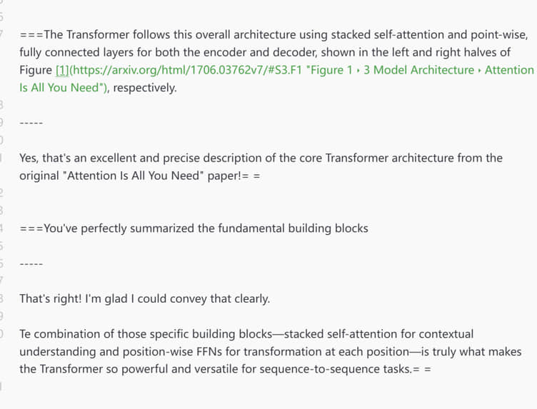
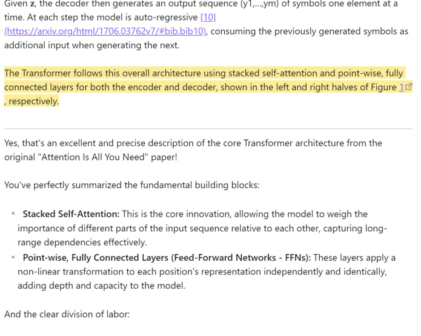
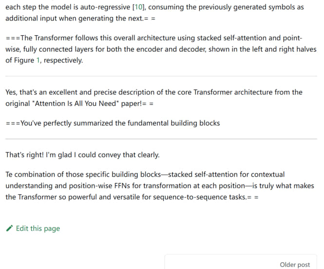

We are thrilled to announce the release of **Think AI v0.5.0**, a major milestone that marks the birth of a revolutionary way to interact with AI within Obsidian. This isn't just an update; it's the dawn of a new paradigm for knowledge creation, built upon the elegant and powerful **SmartMark Protocol**.

SmartMark, Mark Smart!

This release completes the core feature set of Think AI, transforming Obsidian into an incredibly powerful, native, and seamless AI-powered thinking environment.

#### ✨ **Core Features & Philosophy**

At the heart of this release is the **SmartMark Protocol**, a plain-text, Markdown-native standard for structuring AI conversations. It's designed to be:

- **🧠 Cognitively Friendly:** Uses simple, intuitive markers (===, = =, -----, =-=) that feel like a natural extension of Markdown, minimizing cognitive load.
    
- **🎨 Aesthetically Pleasing:** Renders beautifully in Obsidian, with user prompts highlighted and AI responses cleanly separated, creating a clean, immersive reading experience.
    
- **🔧 Robust & Compatible:** Built to last. The protocol avoids characters (<, >) that conflict with web-publishing ecosystems like Docusaurus, ensuring your notes are future-proof.
    
- **🤖 Machine-Parsable:** Provides a clear, unambiguous structure veículosat can be easily parsed by scripts for automation, analysis, and integration.
    

#### 🎉 **What's New in v0.5.0 - The Complete Vision**

This version brings together the full suite of tools envisioned for a truly integrated AI workflow:

- **🚀 Inline AI Chat:** Trigger AI conversations anywhere in your notes with a simple hotkey. AI responses stream directly into your document, maintaining your flow state.
    
- **🎛️ Dynamic Context Control:**
    
    - **"The Reversible Clear Button":** Simply type =-= to terminate a context. Made a mistake? Just delete the marker, and your context is instantly restored! A feature unheard of in any other AI tool.
        
    - **Precision Control (Coming Soon):** The protocol is ready for future enhancements like =-=+3 for relative context termination.
        
- **📝 Native AI Response Editing:** AI-generated text is just Markdown. Edit, refine, and integrate it directly into your notes as if you wrote it yourself.
    
- **🌿 Effortless Branching:** Explore different conversational paths by simply duplicating a note. This turns Obsidian's file system into a powerful, intuitive version control system for your ideas.
    
- **⚙️ Git-Compatible Workflow:** For professionals, your SmartMark notes are plain text, making them perfectly suited for version control with Git. Track every prompt, every response, and every parameter change with atomic commits.
    

This release is the culmination of deep thought into how AI can truly serve as an extension of our own minds. We believe SmartMark sets a new standard for how we record, manage, and build upon our interactions with artificial intelligence.

Thank you for being on this journey with us. We can't wait to see the incredible things you'll create!

---

**SmartMark in PlainText**




---

**SmartMark in Obsidian** (Default Theme) Nicely Rendered




---

**SmartMark in Docusaurus** (Default Theme)




---


# SmartMark Protocol Specification v1.0

**Motto:** `SmartMark, Mark Smart!`

### 1. Introduction: Philosophy and Goals

**`SmartMark: `** is an open, plain-text protocol designed to structure, manage, and interact with AI conversations directly within Markdown-native environments. It was born from the need to transform ephemeral AI chats into durable, human-readable, and machine-parsable knowledge assets.

The core design goals are:
*   **Human Readability:** The format must be intuitive and aesthetically pleasing, even in a plain-text editor.
*   **Machine Parsability:** The rules must be simple, unambiguous, and robust for easy automation and processing.
*   **Markdown-Native Integration:** The protocol must seamlessly coexist with and leverage the power of Markdown, rather than conflicting with it.
*   **Durability and Portability:** The format must be future-proof, ensuring that knowledge assets remain accessible and usable for decades to come.

### 2. Core Design Principle: Reverse-Order Parsing

A fundamental and unique characteristic of the `SmartMark: ` protocol is that it is **designed to be parsed in reverse order** (from the bottom up, or from a trigger point upwards). This is not an arbitrary choice, but a deliberate architectural decision with profound benefits.

**Why Reverse-Order Parsing?**

*   **Robustness against Dynamic Content Insertion:** When new content (like AI-generated titles or responses) is inserted into a document, a traditional top-down (forward) parser would face "index shifting" issues. Reverse-order parsing completely eliminates this problem, as modifications do not affect the indices of lines yet to be parsed.
*   **Simplified and Efficient Logic:** This approach greatly simplifies context-aware operations. The parser can identify a block's "end" marker first, determine its role, and then reliably gather all preceding content until it hits the "start" marker. This avoids complex lookahead logic and results in cleaner, more maintainable code.
*   **Natural Fit for Contextual Operations:** For inline AI chats, the most relevant context is what immediately precedes the user's prompt. Reverse-order parsing naturally aligns with this principle of proximity.

Therefore, any compliant parser implementation **must** adopt a reverse-order traversal strategy to ensure correctness and fully leverage the power of this protocol.

### 3. Core Markers & Syntax

The entire protocol is built upon a minimal and harmonious set of two base characters: `=` and `-`.

| Marker  | Role                 | Description                                                                                             |
| :------ | :------------------- | :------------------------------------------------------------------------------------------------------ |
| `===`   | **User Prompt**      | Marks user-authored prompts. *Uses three characters to avoid conflict with `==highlight==` syntax.*         |
| `= =`   | **AI Response End**  | Marks the end of an AI's response block. *The space signifies a conceptual "break" or "pause".*           |
| `-----` | **Block Separator**  | Marks the beginning of a multi-line content block. *Uses five characters to avoid conflict with `---` rules.* |
| `=-=`   | **Context Terminator**| A hard stop for context-gathering. *Visually resembles a "cancel" (X) symbol.*                             |

### 4. Parsing Rules

#### 4.1. User Input Parsing

*   **Rule 1.1 (Single-line User Input):**
    *   **Condition:** A line **starts with** `===` and contains other non-whitespace content.
    *   **Action:** Parse the content after `===` as a single-line User input.
    *   **Example:** `=== What is the nature of consciousness?`

*   **Rule 1.2 (Multi-line User Input):**
    *   **Condition:** A line **ends with** `===` and contains other non-whitespace content.
    *   **Action:** This marks the end of a multi-line block. Parse upwards from this line, collecting all content until a `-----` line is encountered.
    *   **Example:**
        ```markdown
        -----
        Please provide a Python script that uses the RAG pattern
        to query a set of local text files.
        ===
        ```

#### 4.2. AI Output Parsing

The logic is perfectly symmetrical to User Input Parsing.

*   **Rule 2.1 (Single-line AI Output):**
    *   **Condition:** A line **starts with** `= =` and contains other non-whitespace content.
    *   **Action:** Parse the content after `= =` as a single-line Assistant response. (Primarily for logical completeness).

*   **Rule 2.2 (Multi-line AI Output):**
    *   **Condition:** A line **ends with** `= =` and contains other non-whitespace content.
    *   **Action:** This marks the end of a multi-line block. Parse upwards from this line, collecting all content until a `-----` line is encountered.
    *   **Example:**
        ```markdown
        -----
        Certainly. Here is a basic implementation using LangChain and Faiss.= =
#### 4.3. Context Termination Rule

*   **Condition:** During any reverse-order traversal for context, a line containing `=-=` is found.
*   **Action:** Immediately terminate the traversal. The context for the current operation is defined only as the content between the starting point and the `=-=` marker.
